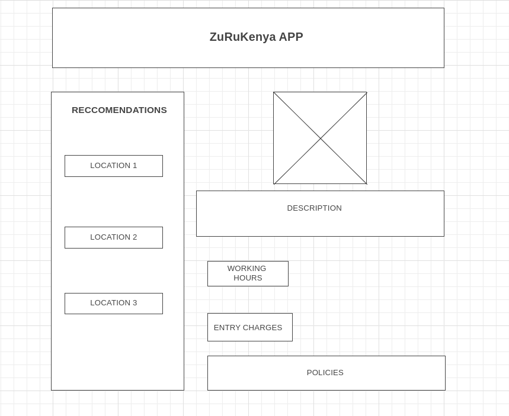

# ZuRuKenya Web APP

## Introduction

This project entails creating a travel directory Web application called ZuruKenya. It gives tourists recommendations of places to visit within Kenya. The app is meant to enlist tour recommendations and then tourists can view. A recommendation will include a photo, a description, charges, opening and closing hours, and policies of the place to visit. The admin will be able to add these details on an admin form which will save on the server and the recommendation will show up in the web.

## The Client Side

The client side shows suggestions on different areas a user can visit within the country. An overview image of the tour location, entry fee charges, opening and closing hours and policies.

## Images

The following image has been used in the app.

## Color Palette

The following is the chosen color scheme:

## Fonts

The following are the fonts used for this project:

1. Nunito (Google Fonts)
1. Source Serif Pro (Google Fonts)

## Pages

The web application has the following pages:

## About us

This page provides a summary of the services by the application.

#### The Client View Page

The client side shows suggestions on different areas a user can visit within the country. An overview image of the tour location, entry fee charges, opening and closing hours and policies.

#### The Site Update Form/view

The admin view shows the form template for the admin to add details to the recommendations on user view.

## Definition of Terms

#### Location

This is the particular place suggested to visit.

#### Image

This is a link to an image that gives the general impression , represented by the location in form of a piece of art.

#### Description

This is an overview of the location in terms of the history of the place, what the person is likely to experience, see, and learn about the location.

#### Charges

This are the rates charged for entry to the location. Divided into citizen and non citizens, adults, students and children.

#### Policies

This are the rules or guidelines that a user is supposed to adhere to within the location or meet before they get to location.

## Functionality

This page provides a summary of the services by the application.

### To run the app locally

From inside the directory containing this project, run npm run server to start the JSON server you can verify the server is running by navigating to http://localhost:8002/recommendations

Leave the server running for now. Open a second terminal window and navigate to the directory and run npm start to start the up running on the browser. the app opens on the broswer through this link http://localhost:8000/. The App works by Fetching data based first load displaying that data on the page. JSON Server follows RESTful conventions. As a result of these conventions, we can expect to be able to access specific records directly by clicks.

If you open a new tab in your browser and visit http://localhost:8000/admin-form, you will be able to add details to the browser by filling up the form.

By capturing user input via event listeners and using fetch requests, we can update the ZuruKenya web page content as a user requests it.

### To run the app in the browser directly

In your browser, copy or follow link https://vermillion-bienenstitch-d21ea5.netlify.app/.

### To view and update json file details on heroku

In your browser, https://zurukenya.herokuapp.com/recommendations

## To load details for the browser

To update details on the browser, an admin can fill details though the form via this link: https://vermillion-bienenstitch-d21ea5.netlify.app/admin-form.
